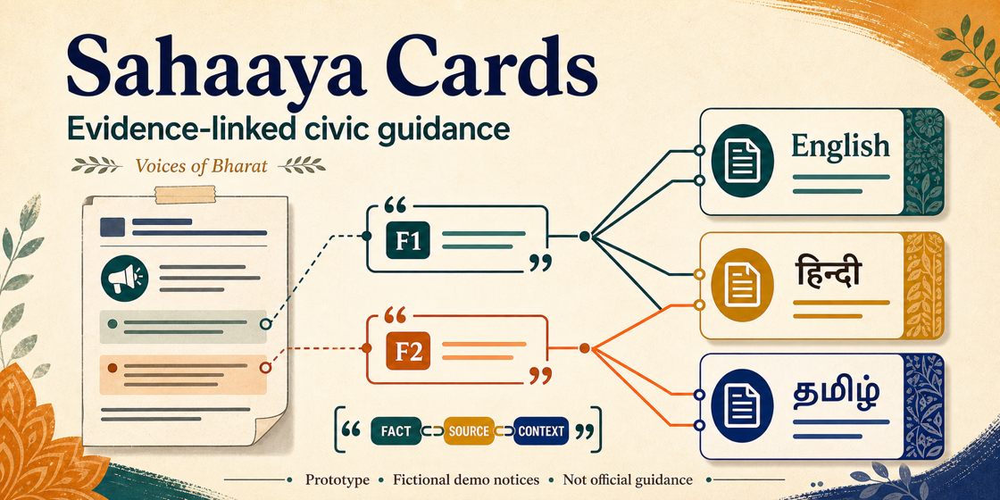

# Sahaaya Cards



Sahaaya Cards is an offline, multilingual civic-notice copilot design for the **Voices of Bharat** track. The reviewed implementation is intended to turn each of two authored English-language civic notices into an exact-quote fact ledger and concise action cards in English, Hindi, and Tamil. A second Gemma 4 pass is designed to check every visible claim, and deterministic Python validation rejects any result whose evidence chain is incomplete. It is a fixed, reproducible source prototype rather than a general file-upload product.

The prototype is intentionally narrow: it summarizes a supplied notice. It does not search the web, authenticate a notice, infer missing facts, contact authorities, or replace the current official notice.

## Current evidence status

The Keras/Torch two-pass app candidate is **implemented and statically
reviewable, but not runtime-proven**. Its three Private, Internet-disabled
Kaggle T4 x2 attempts remained incomplete: V4 ended during direct GPU model
loading with an out-of-memory error, V5 was killed during CPU staging after
host memory exhaustion, and V6 did not reach validated end-to-end generation.

A separate JAX model-parallel smoke, Version 7, ran on an official Private,
Internet-disabled T4 x2 session with only the official competition input,
pinned official Gemma 4 model, and audited wheel Dataset. Its exact source,
server-normalized metadata, and extracted pure-Python vendor tree passed the
dedicated validator. The bounded runtime itself ended after 452.703 seconds as
`DIAGNOSTIC_FAILURE` / `ValueError` at `model_load_started`. Model weight loading
did not complete; no generation or Sahaaya Cards app pass occurred.

Accordingly, this repository claims no generated card, successful app runtime,
PASS rate, translation quality, or measured social impact. The visual example
in `ILLUSTRATIVE_OUTPUT.md` is hand-authored solely to explain the interface and
is **not model-generated**. Version 7 is diagnostic evidence for a distinct JAX
loading route, not evidence for the Keras/Torch two-pass application.

[Watch the 114-second silent fixture walkthrough](assets/sahaaya-cards-fixture-prototype.mp4).
It is a hand-authored, fixture-only visualization of the proposed interface—not
model output, a validated translation, or evidence of a successful runtime.

## Why this matters

Time-sensitive notices are often long, monolingual, and difficult to scan. Translation alone is not enough: a fluent translation can quietly add a date, location, or instruction that was never present. Sahaaya Cards makes provenance visible. Each extracted fact must include an exact source quote, and every headline and action must cite fact IDs.

This design aims to help a reader see three things quickly: what the notice actually says, what action it supports, and what the system must not infer. It is a prototype for accessibility and evidence visibility, not an automated public-warning authority.

## Where Gemma 4 is essential

Gemma 4 Instruct 2B is the semantic engine, not a decorative wrapper:

1. **Generation pass.** Given the untrusted notice, Gemma 4 must extract an atomic fact ledger and draft exactly one English, Hindi, and Tamil card as strict JSON. Every fact carries an exact quote; every visible claim cites fact IDs.
2. **Verification pass.** Given the original notice plus the generated ledger and cards, the same Gemma 4 model performs a separate pass that evaluates each headline and action for entailment, cited evidence, and translation ambiguity.
3. **Fail-closed decision.** Deterministic code then enforces schema, exact-quote membership, ID integrity, three-language coverage, complete verifier coverage, and zero unsupported claims. Gemma provides multilingual interpretation; inspectable code provides structural guarantees.

The implementation defines two separate calls with separate outputs. If generation fails its schema/evidence gate, verification is not run. If either stage fails, the result is retained as a failure record and is not rendered as an approved card.

## Kaggle runtime contract

- Competition: `build-with-gemma-ieee-cs-srmist-ktr`
- Official attached model: `keras/gemma4/keras/gemma4_instruct_2b/2`
- Model path: `/kaggle/input/models/keras/gemma4/keras/gemma4_instruct_2b/2`
- Framework candidate: KerasHub 0.28.0 with Keras/Torch, plain `float16`, greedy sampling, and prompt stripping
- Notebook: Private
- Internet: Disabled
- Tested accelerator: free Kaggle T4 x2, with the reviewed model placed on GPU 0; this route did not complete within available memory
- Inputs: the official Gemma 4 model, the competition source, two embedded fictional notices, and one private dataset containing the locally audited pure-Python KerasHub wheel
- Excluded: API keys, external services, personal data, shell commands, subprocesses, package installers, network fallbacks, and dynamic imports

The notebook does not blindly install the KerasHub wheel. Before import it checks the pinned archive SHA-256, size bounds, pure-Python tag, canonical path and directory encoding, regular-file type, a narrow file-suffix allowlist, complete wheel `RECORD`, and every recorded member digest. It extracts to a new local directory, verifies the extracted inventory again, and confirms that the imported KerasHub 0.28.0 package came from that directory. It separately inspects bounded model JSON and the attached inventory for `Gemma4Backbone`, `Gemma4CausalLM`, and the expected shards before loading `Gemma4CausalLM.from_preset(..., dtype="float16")`.

This contract describes the public Keras/Torch two-pass app. The separate
Version 7 JAX smoke used the same pinned official model and audited wheel to
test model-parallel loading only; it did not execute either app prompt or
produce a card artifact.

Generation uses a 2048-token total-sequence budget and verification uses 3072; the official tokenizer must prove that at least 512 completion tokens remain before either call. TensorFlow GPU visibility is disabled before Keras import, Torch must see exactly two T4 GPUs, and the reviewed variables must be plain `float16` on `cuda:0`. An atomic `runtime_journal.json` records only bounded status, counts, failure class, and hashes. Model JSON and model-returned JSON are bounded, duplicate object keys and undeclared schema fields are rejected, and each strict-JSON raw final answer must be semantically identical to its parsed object before rendering.

These are source-level implementation facts, not runtime-success evidence.
V4-V6 show that the tested Keras/Torch memory routes were insufficient; Version
7 shows only a validated JAX diagnostic that reached `model_load_started` and
then failed closed. There is no alternate model, network install, fabricated
result, or unverified fallback.

## Reproducible artifact chain

- `sahaaya_cards_demo.ipynb` — self-contained two-notice Gemma 4 candidate
- `kernel-metadata.example.json` — Private, Internet-off, free-GPU template;
  replace `YOUR_KAGGLE_USERNAME` only in your own Kaggle copy
- `dataset-metadata.example.json` — Private wheel-Dataset metadata template
- `fixtures/` — the same two fictional notices in machine-readable form
- `validate_project.py` — fail-closed static and runtime-artifact validator
- `build_demo.py` — standard-library-only offline HTML renderer; refuses absent or failing runtime artifacts
- `tests/` — validator and renderer refusal/escaping tests
- `ILLUSTRATIVE_OUTPUT.md` — hand-authored, non-model-generated interface example with a visible evidence chain and explicit warning banner
- `assets/sahaaya-cards-fixture-prototype.mp4` — 114-second silent, hand-authored fixture walkthrough with persistent evidence-boundary labels; not model output or runtime evidence
- `WRITEUP_DRAFT.md` — judge-facing draft that reports the memory-limited runtime evidence without placeholders or fabricated results
- `tools/` and `dependencies/` — wheel audit implementation, audit result, and upstream license; the wheel itself is excluded
- `schemas/` — machine-readable private runtime-artifact contract
- `DEPENDENCIES.md` and `SECURITY_AND_PRIVACY.md` — source provenance and public/private boundaries
- `MANIFEST.sha256` — exact public source inventory and hashes

For a private clone, replace the owner placeholder consistently in the notebook
and both metadata templates. The validator contains no private owner: it accepts
only a safe clone owner bound to the pinned Dataset slug, and checks that the
notebook Dataset reference/path and kernel/Dataset owners agree. Keep the
filled-in clone private; this public tree must retain the placeholder.

Run the local checks without loading the model or importing the wheel:

```text
python3 validate_project.py
python3 -m unittest discover -s tests -v
```

Validate a Kaggle-produced `demo_results.json` directly from its download directory;
it does not need to be copied into the reviewed source tree:

```text
python3 validate_project.py --runtime /path/to/downloaded/demo_results.json \
  --journal /path/to/downloaded/runtime_journal.json
```

This command performs both the outer schema/configuration checks and the
renderer’s duplicate-key-safe deep evidence normalization: trusted fixture
hashes, exact quotes, fact IDs, card coverage, verifier coverage, and timings.
Kaggle kernel `COMPLETE` alone is never treated as a card PASS.

Only after that command reports `runtime_artifact=PASS` and
`runtime_semantic_evidence=PASS`, build the self-contained HTML demo:

```text
python3 build_demo.py --input /path/to/downloaded/demo_results.json
```

The renderer calls `validate_runtime_artifact(..., require_pass=True)`, rechecks fixture hashes, ledger quotes, card evidence, and verifier coverage, then renders only a fixed field whitelist. Every runtime-derived value is escaped. The page has an offline Content Security Policy and contains no JavaScript, remote asset, form, analytics, or network request. If the runtime artifact is absent or invalid, no page is written.

## Responsible boundaries

A deterministic PASS would mean that this prototype found a complete evidence chain under its authored checks. It would not mean that an authority endorsed the card, that the source was authentic/current, or that every translation nuance was correct. Critical instructions still require comparison with the current official notice. Real deployment would require authenticated source ingestion, native-speaker review, accessibility testing, adversarial evaluation, and field trials with affected communities.

## License

Project code and documentation are released under Apache License 2.0. The attached Gemma model remains governed by its upstream terms and is not redistributed here.
